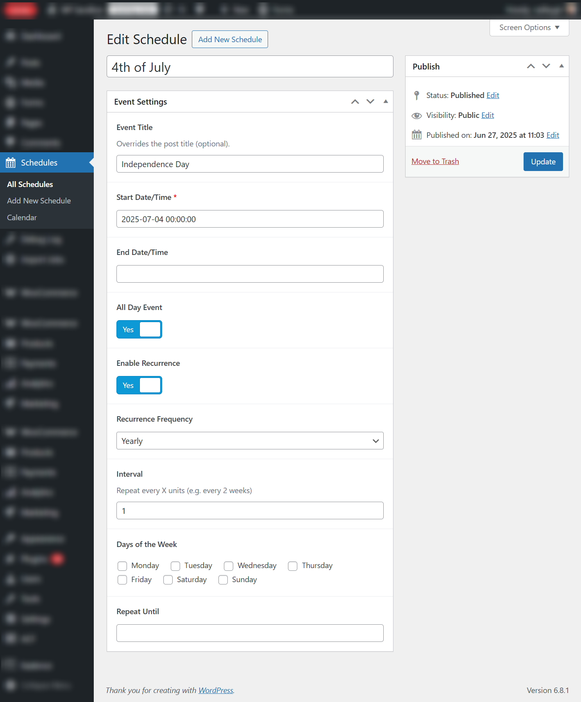
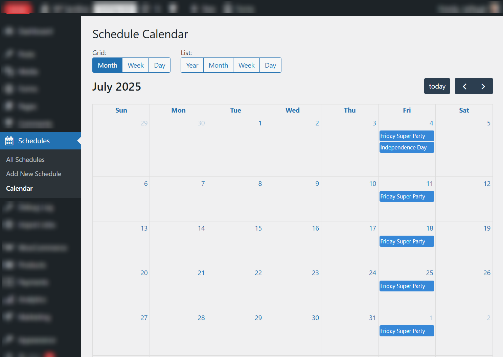

# RS Schedule

Adds a <code>schedule</code> post type, allowing you to create standard and recurring events. The events can be seen on a Calendar page which uses the FullCalendar API with the RRule integration. On the day of each event, a cron action is triggered, allowing you to run custom code or send notifications on a customizable schedule.

## Required Plugins

1. [Advanced Custom Fields PRO](https://advancedcustomfields.com/)

## How to Use

1. Install the plugin and activate it.
2. Use the "Schedule > Add New Schedule" link to create a new scheduled event.
3. Use the "Schedule > Calendar" to display current events in a calendar format.

The event will be triggered once per day by triggering the action `rs_schedule/event`. The schedule Post ID will be passed as the first parameter.

## Frequently Asked Questions

### Q: How do I run custom code on the event?

You can add the `rs_schedule/event` action to run custom code for an event:

```php
function my_custom_event_handler( $post_id, $today ) {
      // Your custom code here
      error_log( "Event triggered for post ID: $post_id on $today" );
}
add_action( 'rs_schedule/event', 'my_custom_event_handler', 10, 2 );
```
      
### Q: What if an event spans multiple days?

The event will only be triggered on **the first day of the event**.

For recurring events, the action is still triggered on every recurrence, but only the on the first day.

If you need to run code on the days spanning the event, consider adding your own scheduled events instead.

### Q: Can I add custom events to the calendar?
Yes, you can add events to the calendar using the `rs_schedule/get_calendar_events` filter. 

However, this should only be used to display events. Events added using this filter do not trigger the `rs_schedule/event` action.

Example of adding a custom event:

```php
/**
    * Add custom events to the calendar.
    *
    * @param array $events {
    *     @param string $id                - Unique identifier based for the event. Default: "schedule_" . $post_id
    *     @param string $title             - The title of the event.
    *     @param array|null $rrule         - Recurrence rule settings, if the event is recurring. {
    *         @param string $freq          -     - Frequency of recurrence (e.g., 'daily', 'weekly', 'monthly', 'yearly').
    *         @param int $interval         -     - Interval for recurrence (e.g., every 2 weeks).
    *         @param string $dtstart       -     - Start date/time of the event in ISO format (Y-m-d\TH:i:s).
    *         @param array|null $byweekday -     - Days of the week for recurrence (e.g., ['mo', 'we']).
    *         @param string|null $until    -     - End date for recurrence in ISO format (Y-m-d), if applicable.
    *     }
    *     @param string|null $start        - Start date/time of the event in ISO format (Y-m-d\TH:i:s), if the event is non-recurring.
    *     @param bool $allDay              - Whether the event is an all-day event.
    * }
    *
    * @return array
    */
function my_custom_calendar_events( $events ) {
    $events[] = [
        'title' => 'Custom Event',
        'start' => '2023-10-01T10:00:00',
        'end'   => '2023-10-01T12:00:00',
        'url'   => 'https://example.com/custom-event',
    ];
    return $events;
}
add_filter( 'rs_schedule/get_calendar_events', 'my_custom_calendar_events' );
```

## Screenshots

### Preview of the Schedule post type and custom fields



### Preview of the Calendar page



## Development Setup

This plugin uses the [@rlanvin/php-rrule](https://github.com/rlanvin/php-rrule) library for RRule support within PHP. It is installed using the following Composer command:

```bash
composer require rlanvin/php-rrule
```

## Changelog

### 1.0.0
- Initial release